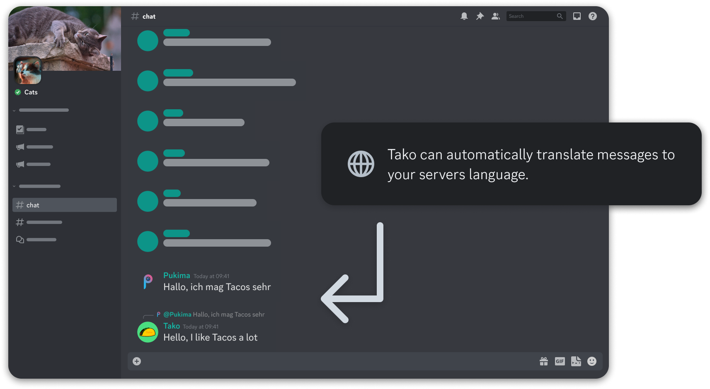
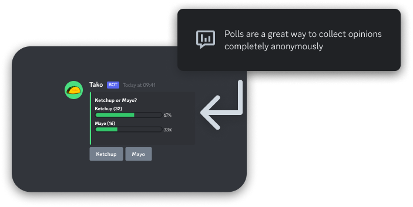

# ✨️ Features

## Automatic Translation



By default, Tako's language is set to English, however, you can change it between 11 different languages!

Once someone with Manage Server permissions activated Autotranslate with ```/auto_translate toggle```, every single message not being detected with the language previously set up (or default: English), is going to be translated to the right language. 

This feature easily eliminates language barriers and you can even customize it how you want.

## Polls



You can easily create polls with ```/poll```. The bot presents a nice bar to show the percentage as well as the number of votes each answer has.