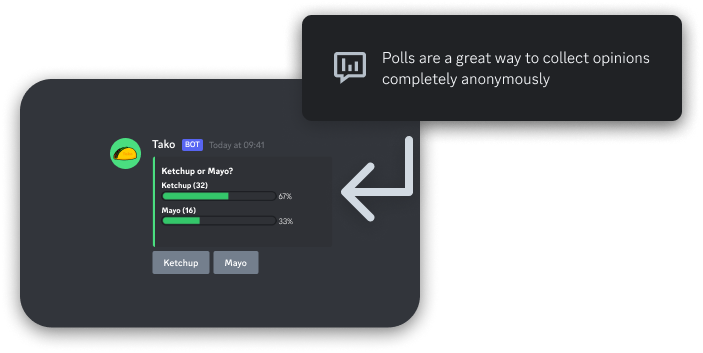

# ✨ Our awesome Features

## Automatic Translation

<figure><figcaption></figcaption></figure>

The default Tako language is set to English. However you can choose between 11 diferrent languages. Once someone with _Manage Server_ permissions activated Autotranslate (`/auto_translate toggle`), every single message not being detected with the language previously set up (or default: English), is going to be translated to the right language. This feature easily eliminates language barriers and you can even customize it how you want.

## Polls

<figure><figcaption></figcaption></figure>

You can easily create polls with `/poll`. It has a nice bar to show the percentage as well as the number of votes each answer has.
